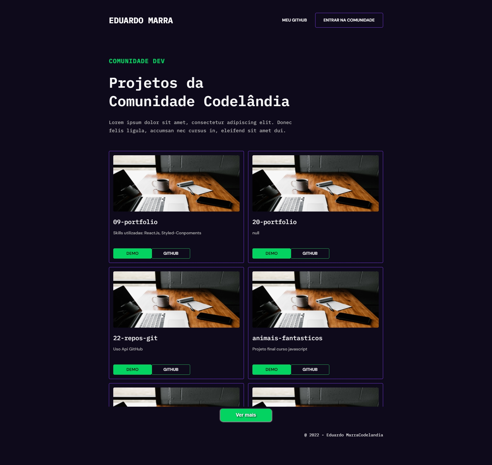

# Portfolio

  

## 💻 Sobre o projeto

---

<a href="https://20-portfolio.vercel.app/" target="_blank">Versão online</a>

É um desafio criado pela comunidade [Codelândia](https://discord.gg/wNCWTVuxyz). O layout original está no [Figma](https://www.figma.com/file/Yb9IBH56g7T1hdIyZ3BMNO/Desafios---Codel%C3%A2ndia?node-id=58198%3A756).

## 🚀 Tecnologias

---

Esse projeto foi desenvolvido com as seguintes tecnologias:

- HTML
- CSS
- Javascript
- Deploy realizado na Vercel

### Rodando localmente

1. Abrir arquivo index.html
<!-- ---

1. Instalar todos os pacotes com `yarn install`
2. Executar o comando `yarn dev`
3. Em alguns seguntos a URL: `http://localhost:3000/` ficará disponível -->